# Hello World Spring Boot Application

- Configure and Install Jenkins on AWS EC2.
- Create a CI/CD pipline to compile, test & package the application.
- Extend the pipeline to deploy to AWS EC2.

## 1. Configure and Install Jenkins on AWS EC2.

- Create an `EC2` instance on `AWS`. If you don't know how to create an `EC2` instance, please checkout my [static-portfolio-website](https://github.com/akshatoxy/static-portfolio-website) repo. You also have to create a `role` from `AmazonSSMManagedInstanceCore policy` and attach it to you `EC2` instance.

- To install `Jenkins` you have to login to your `EC2` instance. You can create a key pair and `SSH` into your instance but I am going to use `SSM Session Manager`.

- In order to use `SSM Session Manager` to login to your `EC2` you have to manually install `SSM agent` in your `EC2`. There are some `AMI's` that comes with a pre-installed `SSM agent` like, `Amazon Linux 2` etc. Checkout `AWS Docs` for installing `SSM agent` manually. [Click Here](https://aws.amazon.com/premiumsupport/knowledge-center/install-ssm-agent-ec2-linux/) 

- Then from you instances tab select your `EC2` instance and click on **connect**.

  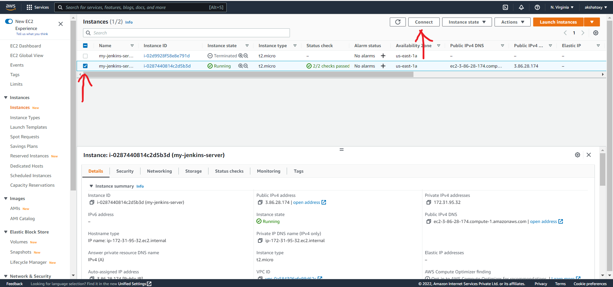

- Then click on the `Session Manager` tab and click on **connect**.
  
  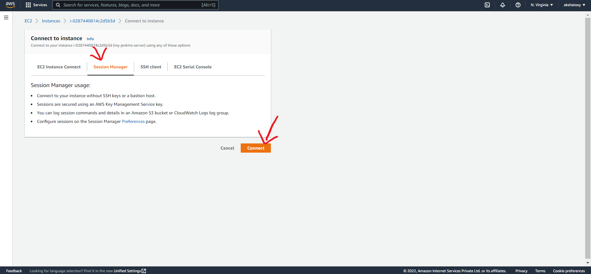

- A new browser tab will open where you can use the terminal and configure your `EC2`. By default you will be login as `ssm-user` use `sudo su - ec2-user` to change user.

- Run `sudo yum update` to update the applications installed on a system.

- Install `Java` before installing `Jenkins` because jenkins requires `Java` to run. The recommended version is java 11 so run `sudo amazon-linux-extras install java-openjdk11` and `sudo yum install java-11-openjdk-devel` to install java and javac. 

- After that run `sudo wget -O /etc/yum.repos.d/jenkins.repo https://pkg.jenkins.io/redhat-stable/jenkins.repo`,
`sudo rpm --import https://pkg.jenkins.io/redhat-stable/jenkins.io.key` and `sudo yum upgrade` to add the repositories locally. Then run `sudo yum install jenkins` and finally `sudo systemctl enable jenkins` to start jenkins at boot, `sudo systemctl start jenkins` to start jenkins and `sudo systemctl status jenkins` to check the status of jenkins.

- You can go to http://{EC2-public-ip}:8080 to launch jenkins dashboard.

- Official Docs to install `Jenkins` on `AWS`. [Click Here](https://www.jenkins.io/doc/tutorials/tutorial-for-installing-jenkins-on-AWS/) 

## 2. Create a CI/CD pipeline in Jenkins to compile, test and package the application.

- You need to unlock `Jenkins` before you can create a `pipeline`.

- Login to you `EC2` using `SSH` or `Session Manager` and copy the contents of the file at `/var/lib/jenkins/secrets/initialAdminPassword` using `sudo cat /var/lib/jenkins/secrets/initialAdminPassword` and copying the output of the command. Then paste it in the Administrator Password section and click Conitnue.

  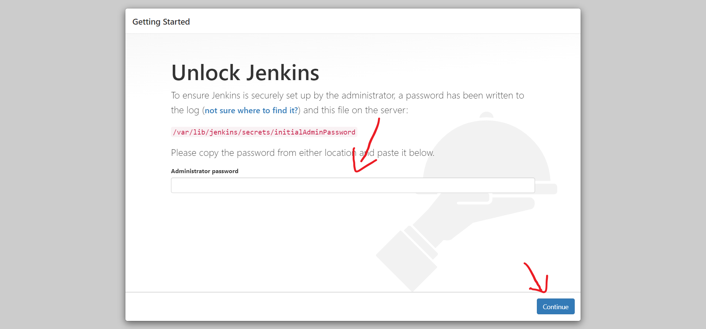

- After that click on `Install suggested plugins` and wait for the installation.

- Then create an admin user and click on `Save and Continue`. You can also `Skip and continue as admin`.

- Then configure the port according to your preference. I am leaving it at default which is 8080. And then click on `Start using jenkins` to launch jenkins dashboard.

- From the homepage click on `Manage Jenkins` in the left panel, then click on `Global Tool Configuration`. Then scroll down and find `Maven`. Click on `Add Maven` then select a version and give it a name. After that click on save. Similarly you can install other build tools like jdk, gradle etc.

  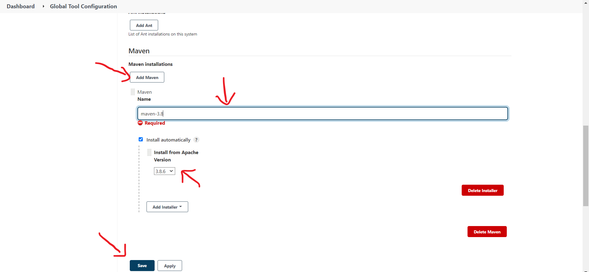

- From the homepage click on `New Item` in the left panel, then select `Pipeline` and give it a name. Click `OK`

  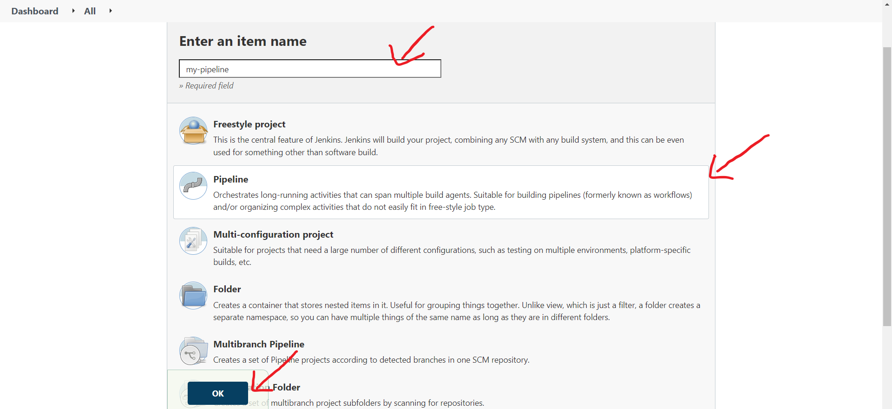

- Select `GitHub hook for GITScm polling` so that the build can trigger automatically based on any event on GitHub like push, pull.

  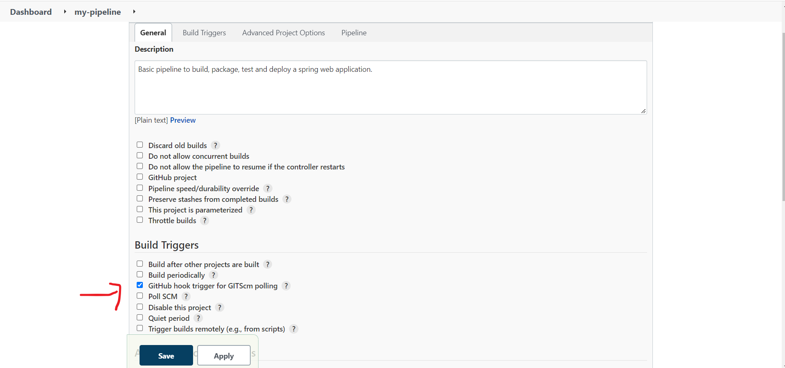
  
- Select `Pipeline script from SCM` then, select `Git` as the SCM. After that add the repository URL then, click on Add to add credentials.  

  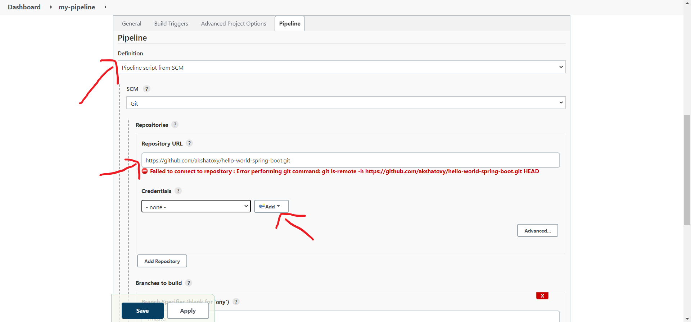

- Fill the details and click Add.

  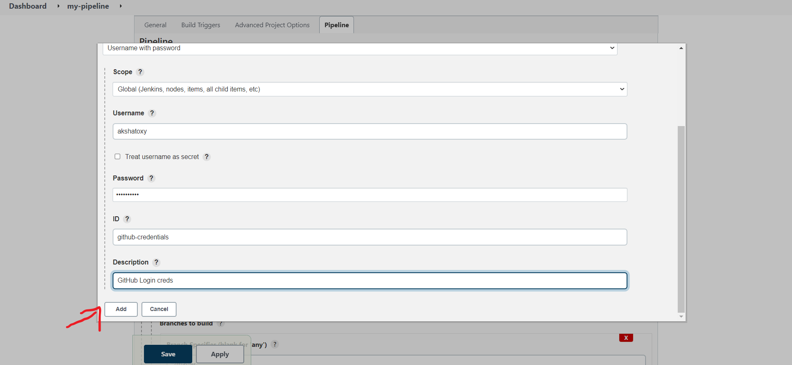

- Add all the branches in which you want to run the pipleline. Add `Jenkinsfile` as script path, also turn on lightweight checkout. Click `Save`.

  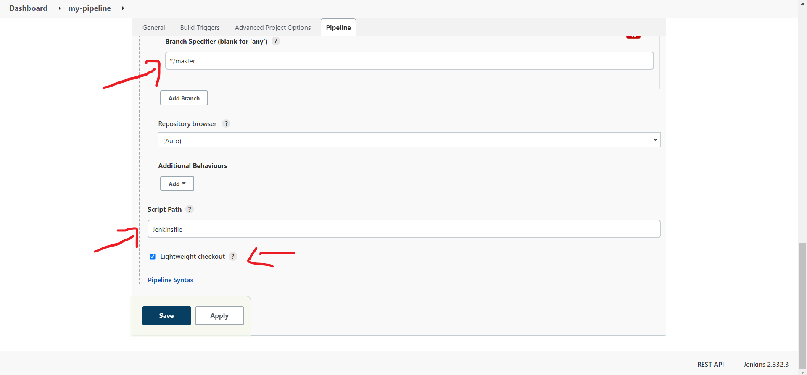

### Now we have setup our pipeline so let's test the jenkins server to check everything is working.

- Create a file in your root folder of your repository and name it `Jenkinsfile`.

- Add simple declarative pipeline script to the your `Jenkinsfile` and push the code to your repository.

  ```
  pipeline {
    agent any
    stages {
      stage("test jenkins server") {
        steps {
          echo "Hello There"
        }
      }
    }
  }
  ```

- Click on `Build Now` to trigger the pipeline. As you can see the pipeline succeeded. Pipeline runs through the stages defined and you can also see how much time it took to complete.

  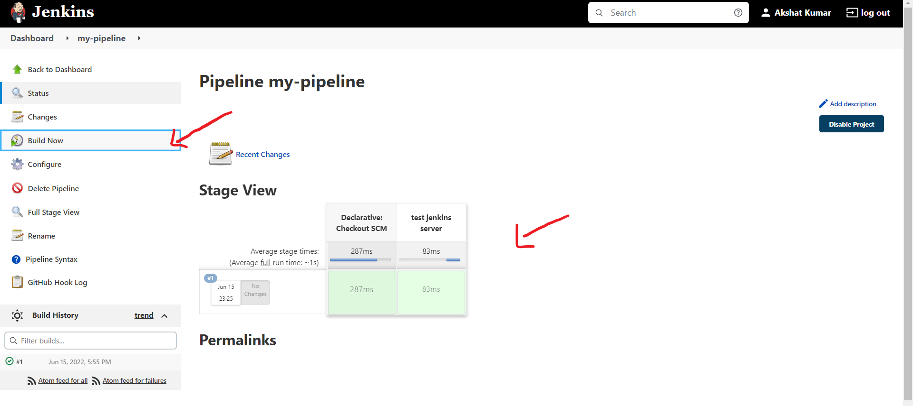

- To view the output Click on the build number in the left corner `#1` and then click on Console Output.

  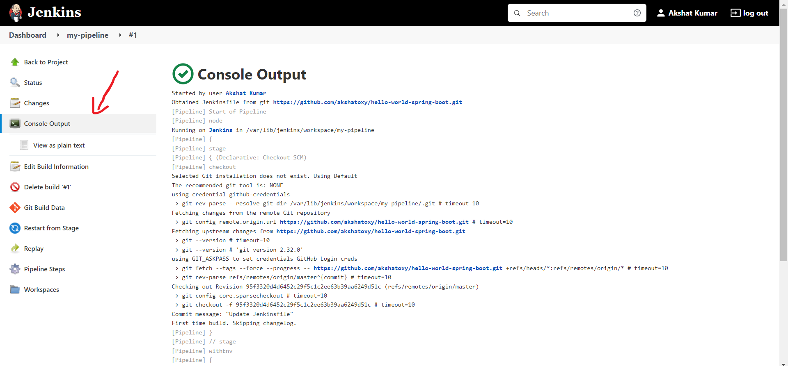

# Now let's modify the Jenkinsfile to compile, test and package the spring application and add automatic build trigger on a push event in the repository.

- 

  